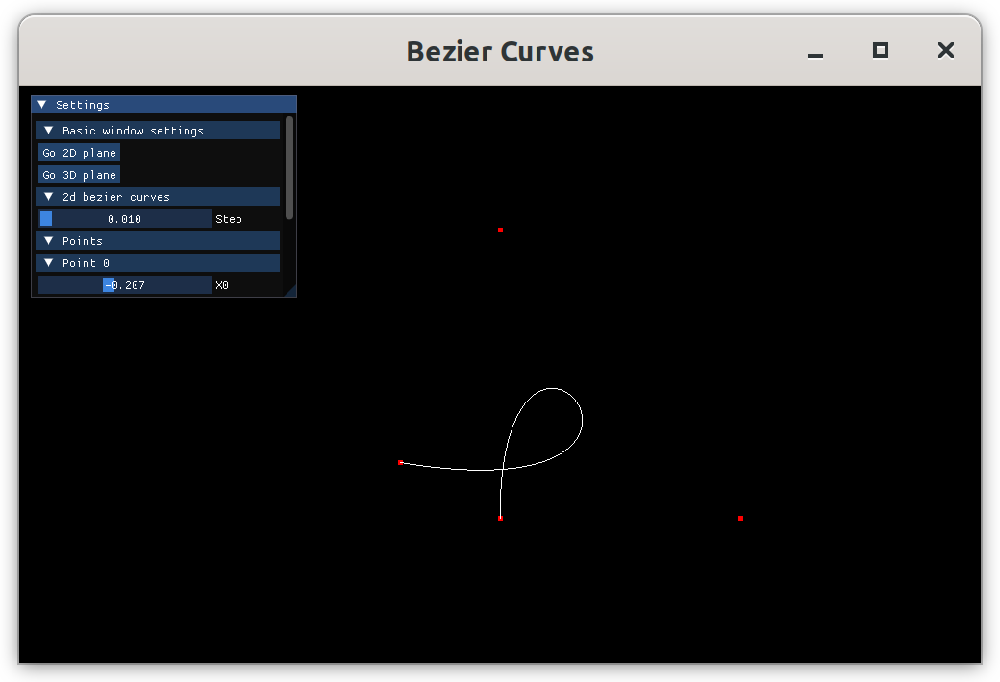
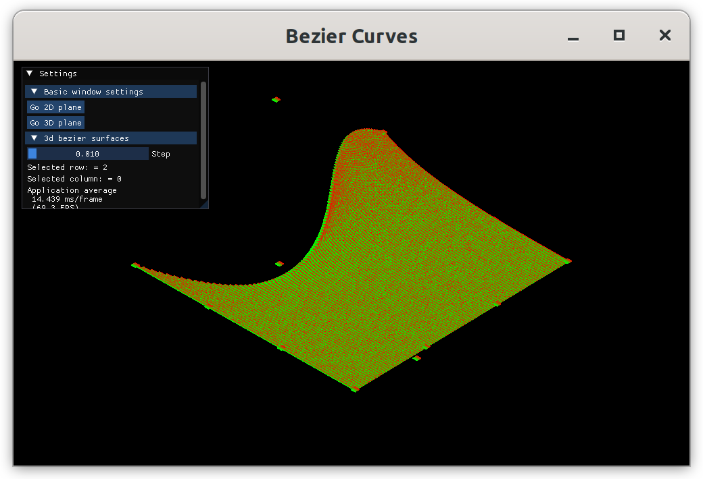
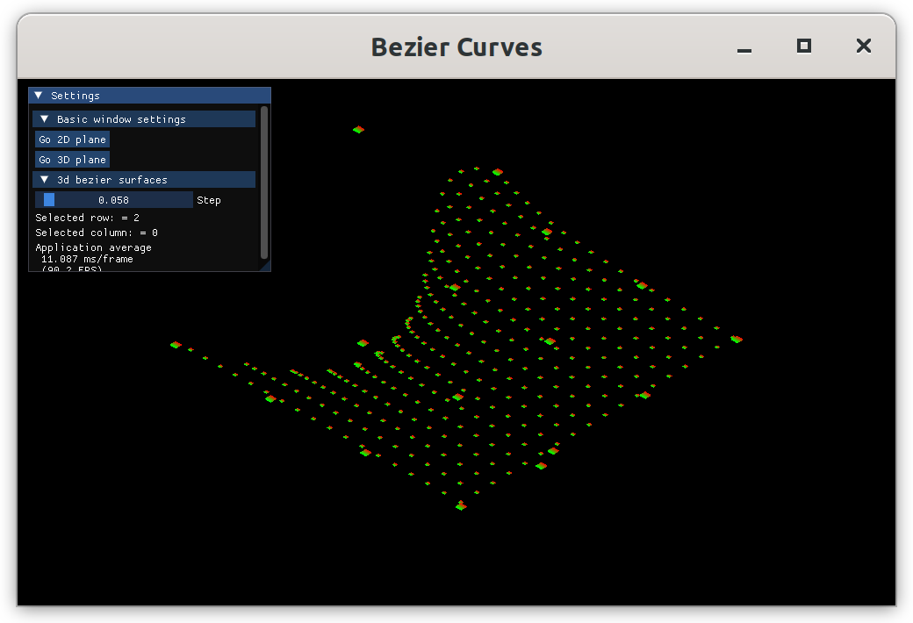

# Bezier Curves & Surfaces Visualization

A modern OpenGL-based 3D visualization tool for exploring Bezier curves and surfaces with an interactive user interface.


*2D Bezier curve visualization with control points*

## 🎯 Project Overview

This project is an interactive 3D graphics application that demonstrates the mathematical beauty of Bezier curves and surfaces. Built with modern OpenGL, it provides real-time visualization of both 2D curves and 3D surfaces, allowing users to understand how control points influence the shape of these mathematical constructs.

### Features

- **2D Bezier Curves**: Interactive visualization of cubic Bezier curves with draggable control points
- **3D Bezier Surfaces**: 3D surface rendering using 4x4 control point grids
- **Real-time Rendering**: Smooth, interactive 3D graphics using OpenGL
- **Camera Controls**: 3D navigation with mouse and keyboard controls
- **Modern UI**: ImGui-based interface for parameter adjustment
- **Shader-based Rendering**: Custom GLSL shaders for beautiful visual output

## 🖼️ Gallery

### 2D Bezier Curve

*Interactive 2D Bezier curve with control points and smooth curve rendering*

### 3D Bezier Surface

*3D Bezier surface visualization with control point grid*

### 3D Bezier Surface (Higher Resolution)

*High-resolution 3D surface with finer tessellation*

## 🏗️ Technical Details

### Dependencies
- **OpenGL**: Modern OpenGL for 3D graphics rendering
- **GLFW**: Window management and input handling
- **GLM**: Mathematics library for vectors, matrices, and transformations
- **ImGui**: Immediate mode GUI for user interface
- **GLAD**: OpenGL loading library

### Architecture
- **C++17**: Modern C++ with object-oriented design
- **CMake**: Cross-platform build system
- **Shader Pipeline**: Vertex and fragment shaders for custom rendering
- **Buffer Management**: Efficient OpenGL buffer handling for performance

## 🚀 Getting Started

### Prerequisites
- C++17 compatible compiler (GCC 7+, Clang 5+, MSVC 2017+)
- CMake 3.0.0 or higher
- OpenGL 3.3+ compatible graphics card
- Linux/macOS/Windows

### Build Instructions

1. **Clone the repository**
   ```bash
   git clone https://github.com/yourusername/bezier-visualization.git
   cd bezier-visualization
   ```

2. **Create build directory**
   ```bash
   mkdir build
   cd build
   ```

3. **Configure with CMake**
   ```bash
   cmake ..
   ```

4. **Build the project**
   ```bash
   make
   ```

5. **Run the application**
   ```bash
   ./my_opengl_project
   ```

### Quick Run
```bash
cd build && ./my_opengl_project
```

## 🎮 Usage

### Controls
- **Mouse**: Rotate camera view
- **WASD**: Move camera
- **ESC**: Close application
- **ImGui Interface**: Adjust parameters, control points, and rendering options

### Features
- **2D Mode**: Visualize cubic Bezier curves with interactive control points
- **3D Mode**: Explore 3D Bezier surfaces with adjustable resolution
- **Real-time Updates**: See changes immediately as you modify parameters
- **Multiple Views**: Switch between different visualization modes

## 🔬 Mathematical Background

### Bezier Curves
The application implements cubic Bezier curves using the Bernstein polynomial basis:
```
B(t) = (1-t)³P₀ + 3(1-t)²tP₁ + 3(1-t)t²P₂ + t³P₃
```

### Bezier Surfaces
3D surfaces are generated using tensor product Bezier patches:
```
S(u,v) = Σᵢ₌₀³ Σⱼ₌₀³ Bᵢ(u)Bⱼ(v)Pᵢⱼ
```

## 📁 Project Structure

```
bezier-visualization/
├── src/                    # Source code
│   ├── main.cpp           # Main application entry point
│   ├── bezierCurve.h      # 2D Bezier curve implementation
│   ├── bezierSurface.h    # 3D Bezier surface implementation
│   ├── camera.h           # Camera and view controls
│   ├── cube.h             # 3D cube geometry
│   └── glad.c/h           # OpenGL loading
├── shaders/               # GLSL shader files
│   ├── vertex_shader.glsl
│   └── fragment_shader.glsl
├── imgui/                 # ImGui library files
├── glm/                   # GLM mathematics library
├── images/                # Screenshots and examples
├── build/                 # Build output directory
├── CMakeLists.txt         # Build configuration
└── README.md              # This file
```

## 🛠️ Development

### Adding New Features
- **New Curve Types**: Extend `bezierCurve.h` for different curve families
- **Surface Modifications**: Enhance `bezierSurface.h` for advanced surface types
- **Shader Effects**: Modify shaders in the `shaders/` directory
- **UI Enhancements**: Extend ImGui interface in `main.cpp`

### Code Style
- Follow C++17 best practices
- Use descriptive variable names
- Include proper error handling
- Document complex mathematical operations

## 🤝 Contributing

1. Fork the repository
2. Create a feature branch (`git checkout -b feature/amazing-feature`)
3. Commit your changes (`git commit -m 'Add amazing feature'`)
4. Push to the branch (`git push origin feature/amazing-feature`)
5. Open a Pull Request

## 📄 License

This project is licensed under the MIT License - see the [LICENSE](LICENSE) file for details.

## 🙏 Acknowledgments

- **OpenGL**: For providing the graphics foundation
- **GLM**: For excellent mathematics utilities
- **ImGui**: For the immediate mode GUI system
- **GLFW**: For cross-platform window management

## 📞 Contact

- **Project Link**: [https://github.com/yourusername/bezier-visualization](https://github.com/yourusername/bezier-visualization)
- **Issues**: Report bugs and feature requests via GitHub Issues

---

**Happy visualizing! 🎨✨**
